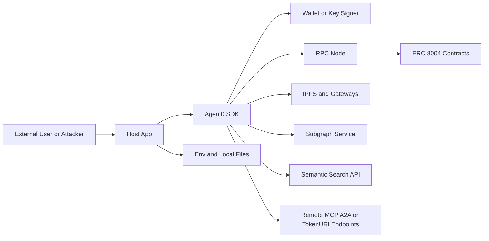

## Executive summary
`agent0-ts` is a library (not a standalone service) that bridges host applications to blockchain contracts, IPFS/storage backends, subgraphs, semantic-search infrastructure, and optionally arbitrary remote MCP/A2A endpoints. The top risk themes are: (1) outbound fetch trust issues (SSRF and malicious remote content), (2) key-management failures when this SDK is used in browser/frontend contexts, and (3) integrity/availability failures caused by unverified off-chain artifacts and unbounded remote data ingestion. The highest-risk code areas are remote URL fetch paths (`src/core/endpoint-crawler.ts`, `src/core/sdk.ts`, `src/core/indexer.ts`, `src/core/ipfs-client.ts`) and signing/write paths (`src/core/viem-chain-client.ts`, `src/core/agent.ts`, `src/core/feedback-manager.ts`).

## Scope and assumptions
In-scope paths:
- `src/**` (runtime SDK behavior)
- `examples/**` (non-production, but reviewed as likely copy-source for integrators)
- `env.example`, `README.md` for operational expectations and usage patterns

Out-of-scope:
- `tests/**`, `release_notes/**`, generated taxonomy datasets (`src/taxonomies/**`) except as context
- External contract code not included in this repo (only ABI usage is in scope)

Assumptions (validated from your input):
- SDK will be used in both frontends and backends for ERC-8004 interactions.
- Examples are not production services, but their patterns are security-relevant for adopters.
- Wallet keys are currently provided via local `.env` for testing (Sepolia), with potential future production use.

Open questions that materially affect ranking:
- Will production/private-value keys ever be used in browser bundles (instead of wallet-provider-only signing)?
- Will host apps expose SDK-backed operations directly to untrusted internet users (multi-tenant API/UI)?
- Are outbound egress controls (domain allowlist/proxy) enforced in production for all SDK fetches?

## System model
### Primary components
- Host application (frontend/backend) embedding `SDK` (`src/core/sdk.ts`, `src/index.ts`).
- Chain client/signing path (`src/core/viem-chain-client.ts`) for read/write/sign.
- Agent lifecycle and registration flow (`src/core/agent.ts`).
- Feedback flow (`src/core/feedback-manager.ts`).
- External data clients:
  - IPFS/pinning/gateways (`src/core/ipfs-client.ts`)
  - Subgraph GraphQL (`src/core/subgraph-client.ts`)
  - Semantic search API (`src/core/semantic-search-client.ts`)
  - Endpoint crawler for MCP/A2A (`src/core/endpoint-crawler.ts`)
- Optional example-local tooling and process execution (`examples/skill-md-portable-installer-example.ts`).

### Data flows and trust boundaries
- User/remote input -> Host app -> SDK method calls (data: agent IDs, URLs, metadata, filters, feedback text).
  - Channel: in-process function calls.
  - Security guarantees: depends on host app only (SDK does not enforce authn/authz).
  - Validation: partial type/format checks in SDK, but no policy-level authorization.

- SDK -> RPC node / wallet provider -> ERC-8004 contracts.
  - Data: signed tx payloads, reads/writes for registration, metadata, feedback, ownership.
  - Channel: JSON-RPC/EIP-1193.
  - Security guarantees: blockchain signature verification and chain consensus.
  - Validation: chain checks exist on some paths (`readContract` chain check; explicit chain check in `giveFeedback`), but write-chain verification is best-effort.

- SDK -> IPFS Pinata/local node/gateways.
  - Data: registration JSON, feedback files, skill markdown, and retrieval payloads.
  - Channel: HTTPS and IPFS gateway HTTP.
  - Security guarantees: transport-level TLS for HTTP paths; content addressing for IPFS CIDs.
  - Validation: timeouts and JSON type checks exist; no universal mandatory content-hash verification for fetched registration artifacts.

- SDK -> Subgraph GraphQL + Semantic search API.
  - Data: search filters, agent IDs, ranking metadata.
  - Channel: HTTPS.
  - Security guarantees: endpoint TLS.
  - Validation: mixed; modern search path uses GraphQL variables (`searchAgentsV2`), but legacy `getAgents` builds query strings.

- SDK -> User-supplied MCP/A2A/tokenURI URLs.
  - Data: fetched JSON or SSE responses.
  - Channel: arbitrary HTTP/HTTPS egress.
  - Security guarantees: only URL scheme checks and request timeout.
  - Validation: minimal schema assumptions; no default host/IP allowlisting.

#### Diagram

## Assets and security objectives
| Asset | Why it matters | Security objective (C/I/A) |
| --- | --- | --- |
| Private keys / wallet authority | Compromise enables unauthorized on-chain writes/transfers and reputation manipulation | C, I |
| Agent registration metadata + URIs | Drives discoverability, trust, and capability representation | I |
| Off-chain artifacts (registration JSON, feedback files, skill markdown) | Tampering can alter behavior/trust decisions in consuming agents | I |
| Feedback/reputation signals | Impacts ranking, trust scoring, and business logic | I |
| Host app network position (backend) | SSRF can expose internal metadata/services and pivot points | C, A |
| SDK availability and query throughput | Search/load flows are often user-facing and latency-sensitive | A |
| Build/example patterns copied into production | Unsafe copy patterns can become long-term security debt | I, A |

## Attacker model
### Capabilities
- Remote internet attacker can supply inputs to host app APIs/UIs that call SDK methods.
- Malicious publisher can register agent metadata/URIs and off-chain payloads visible in ecosystem search.
- Attacker can operate/poison external endpoints that SDK fetches (MCP/A2A URL, HTTP tokenURI, IPFS gateway response path).
- In frontend contexts, attacker can inspect bundle/runtime memory and exploit XSS to steal in-browser secrets.
- Attacker can induce expensive search/fetch patterns to degrade availability.

### Non-capabilities
- Attacker cannot directly bypass blockchain signature validation without key compromise.
- Attacker cannot directly invoke SDK internals unless host app exposes corresponding functionality.
- No native-memory corruption class is expected from this TypeScript codebase itself (logic/config/network trust issues dominate).

## Entry points and attack surfaces
| Surface | How reached | Trust boundary | Notes | Evidence (repo path / symbol) |
| --- | --- | --- | --- | --- |
| `setMCP(endpoint, autoFetch=true)` | Host app passes URL | Host app -> remote URL | Can trigger outbound HTTP POST/GET and parse JSON/SSE | `src/core/agent.ts` `setMCP`; `src/core/endpoint-crawler.ts` `fetchMcpCapabilities` |
| `setA2A(agentcard, autoFetch=true)` | Host app passes URL | Host app -> remote URL | Iterates multiple well-known paths and parses JSON | `src/core/agent.ts` `setA2A`; `src/core/endpoint-crawler.ts` `fetchA2aCapabilities` |
| `loadAgent(agentId)` | Host app passes on-chain ID | Chain/metadata -> remote URI | Reads `tokenURI`, then fetches IPFS/HTTP and parses JSON | `src/core/sdk.ts` `_loadRegistrationFile` |
| Entity-type hydration in search | Keyword/entity type search | Subgraph result -> remote URI | Fetches `agentURI` content when `entityType` missing | `src/core/indexer.ts` `_hydrateEntityTypeForAgent` |
| Feedback file uploads/downloads | `giveFeedback` / `getFeedback` | SDK -> IPFS/gateway | Off-chain JSON hashed/stored and later read | `src/core/feedback-manager.ts` `giveFeedback`, `_getFeedbackFromBlockchain` |
| GraphQL search interface | Host app search params | Host app -> subgraph | V2 uses variables; legacy path builds GraphQL string | `src/core/subgraph-client.ts` `searchAgentsV2`, `getAgents` |
| Semantic keyword search | `searchAgents({keyword})` | Host app -> semantic API | External API call with topK defaults | `src/core/semantic-search-client.ts` `search` |
| On-chain write/sign paths | registration/transfer/wallet/feedback | Host app -> signer/RPC/contracts | Integrity-critical transaction submission | `src/core/viem-chain-client.ts` `writeContract`; `src/core/agent.ts`; `src/core/feedback-manager.ts` |
| Example local tooling execution | Running examples | Local files -> child process | Writes executable scripts and executes Node subprocesses | `examples/skill-md-portable-installer-example.ts` `execFileAsync` |

## Top abuse paths
1. SSRF and internal probing through endpoint discovery
   1. Attacker submits controlled URL to host app route that calls `setMCP`/`setA2A`.
   2. SDK fetches attacker-chosen URL from backend network context.
   3. Attacker maps internal services or cloud metadata endpoints.
   4. Impact: internal data exposure and pivot opportunities.

2. Malicious tokenURI / registration content poisoning
   1. Attacker registers agent with mutable HTTP tokenURI.
   2. Consumer calls `loadAgent` or search hydration.
   3. SDK ingests tampered metadata and capabilities.
   4. Impact: trust and behavior manipulation.

3. Key exfiltration in frontend deployment
   1. Integrator ships `privateKey`-based SDK config in browser context.
   2. Attacker extracts key from JS bundle/runtime or via XSS.
   3. Attacker signs unauthorized contract writes.
   4. Impact: unauthorized ownership/metadata/feedback actions.

4. Availability degradation via broad remote-fetch amplification
   1. Attacker triggers high-volume keyword or entity-type queries.
   2. SDK performs many downstream calls (subgraph/IPFS/semantic API).
   3. Host app threads/event loop saturate under network + parse load.
   4. Impact: degraded search/API availability.

5. GraphQL filter injection on legacy query path
   1. App exposes untrusted filters into `SubgraphClient.getAgents`.
   2. Unescaped values are interpolated in query string.
   3. Attacker causes query-shape manipulation or parse failures.
   4. Impact: data integrity and availability issues.

6. Partial metadata update integrity drift
   1. App sets many metadata entries and re-registers.
   2. Some `setMetadata` tx confirmations fail/time out.
   3. SDK continues and clears dirty flags.
   4. Impact: off-chain assumptions differ from on-chain truth.

7. Chain confusion in wallet-integrated frontend writes
   1. Wallet/provider chain check is unavailable/fails silently.
   2. Host app submits writes expecting chain A.
   3. Transaction goes to wrong chain or errors unpredictably.
   4. Impact: integrity/availability failure and operator error risk.

8. Example-pattern footgun in production clones
   1. Team copies example tooling pattern into production flow.
   2. Local script generation/execution and remote skill ingestion are reused without hardening.
   3. Operational trust assumptions are exceeded.
   4. Impact: local execution risk and unsafe supply-chain behavior.

## Threat model table
| Threat ID | Threat source | Prerequisites | Threat action | Impact | Impacted assets | Existing controls (evidence) | Gaps | Recommended mitigations | Detection ideas | Likelihood | Impact severity | Priority |
| --- | --- | --- | --- | --- | --- | --- | --- | --- | --- | --- | --- | --- |
| TM-001 | Remote attacker via host-app inputs | Host app accepts untrusted URLs/IDs and invokes endpoint crawl/load/search hydration | Abuse outbound fetches to internal or attacker infrastructure (SSRF) | Internal data exposure, network pivoting, service disruption | Host network position, internal metadata/services, availability | URL scheme checks (`http/https`) and request timeouts (`src/core/endpoint-crawler.ts`, `src/core/sdk.ts`, `src/core/indexer.ts`) | No default allowlist, no private-range denylist, no DNS-rebinding defense | Add strict outbound URL policy: allowlist domains, block RFC1918/link-local/metadata IPs, resolve+recheck DNS, route via egress proxy | Log destination host/IP per SDK fetch; alert on private IP attempts and unusual egress patterns | high | high | high |
| TM-002 | Malicious publisher / compromised HTTP source / gateway-manipulated content | Consumer trusts remote registration/skill content without independent integrity check | Serve tampered registration/skill metadata to alter capabilities/trust perception | Capability spoofing, bad routing, malicious instruction injection into downstream agents | Registration integrity, off-chain artifact integrity | Supports IPFS URIs and optional provenance/manifest helpers (`src/core/ipfs-client.ts`, `src/models/permission-manifest.ts`) | SDK load path does not enforce immutable URI+hash verification for registration artifacts (`src/core/sdk.ts` `_loadRegistrationFile`) | Require content-addressed URIs and/or on-chain hash pins for critical artifacts; verify hash before use; reject mutable HTTP in high-trust paths | Alert on tokenURI changes and hash mismatches; track mutable URI usage | medium | high | high |
| TM-003 | Frontend attacker / XSS / bundle inspector | Private key configured in frontend or poorly isolated runtime | Steal private key and submit unauthorized signed writes | On-chain account compromise and unauthorized state changes | Wallet authority, ownership, metadata/reputation integrity | Wallet-provider path exists (`SDKConfig.walletProvider` in `src/core/sdk.ts`) and no-signer read-only mode | `privateKey` accepted generically; no hard runtime guard against browser key usage | Enforce policy: disallow `privateKey` in browser builds; use wallet-provider/KMS/HSM; rotate and scope keys; least-privilege wallets per environment | Monitor tx origin/address behavior; alert on atypical write patterns | high | high | high |
| TM-004 | Remote attacker inducing expensive queries | Host app exposes search/load APIs without rate/size controls | Trigger high-cardinality keyword/entityType searches and remote fetch fan-out | API slowdown/DoS, cost spikes | Availability, infra cost | Timeouts and entity hydration cap (`ENTITY_TYPE_HYDRATION_MAX`) (`src/core/indexer.ts`, `src/core/semantic-search-client.ts`) | No response size limits, no built-in host-level rate limiting/circuit breaking | Add per-request budgets (max agents, max hydrated URIs, max bytes), cache and debounce queries, host-app rate limiting | SLO alerts on latency/error rate; monitor downstream call volume by route | medium | medium | medium |
| TM-005 | Input attacker exploiting legacy query construction | App uses `SubgraphClient.getAgents` with untrusted string filters | Inject malformed GraphQL filter strings via manual interpolation path | Query failure, filter bypass, unstable behavior | Search integrity, availability | Preferred path uses GraphQL variables in `searchAgentsV2` (`src/core/subgraph-client.ts`) | Legacy `getAgents` builds where clause with direct string interpolation | Deprecate/disable legacy string-built query path; escape strictly or force variables-only API | Monitor GraphQL parse/validation errors and anomalous filters | medium | medium | medium |
| TM-006 | Malicious/buggy integrator input | Large or many metadata fields provided and chain/network instability occurs | Trigger partial metadata updates where failures are ignored post-register | Integrity drift between expected and on-chain metadata | Metadata integrity, operational correctness | Metadata key tracking and reserved key guard (`agentWallet`) (`src/core/agent.ts`) | `_updateMetadataOnChain` swallows timeout/failure and continues; no size/count guardrails | Enforce max metadata key/value sizes and count; fail-fast or return partial-failure report; post-write verification readback | Alert on per-key `setMetadata` failures and mismatch between local/on-chain metadata | medium | medium | medium |
| TM-007 | Chain confusion / misconfiguration attacker or operator error | Frontend wallet provider path where chain introspection may fail | Submit writes on wrong network or fail unpredictably | Integrity and availability issues; wrong-chain state updates | Transaction integrity, operator trust | `readContract` chain-id check and explicit chain match check in `giveFeedback` (`src/core/viem-chain-client.ts`, `src/core/feedback-manager.ts`) | `writeContract` wallet chain check is best-effort and errors can be swallowed in check block | Require explicit preflight chain assertion for every write and fail closed if wallet chain cannot be verified | Log configured chain, wallet chain, tx hash; alert on mismatch | medium | medium | medium |
| TM-008 | Unsafe production reuse of example patterns | Team copies examples without hardening | Use local script execution and remote-skill handling patterns in privileged runtime | Local environment compromise or policy bypass | Build/runtime host integrity | Example warns by context only; runtime install artifacts are local (`examples/skill-md-portable-installer-example.ts`) | No programmatic guard preventing example code from production use | Add explicit “DO NOT USE IN PROD” guards/comments and safer production helper module with hardening defaults | Detect example script execution in production CI/CD via path lint rules | low | medium | low |

## Criticality calibration
For this repo and your stated usage (frontend + backend ERC-8004 integration):

- critical:
  - Production private key exposure leading to immediate unauthorized ownership transfer/metadata rewrite.
  - Deterministic cross-tenant data exfiltration from backend internal network via SDK fetch paths.

- high:
  - SSRF-capable outbound fetch with meaningful internal reachability.
  - Unverified artifact ingestion that can alter agent capability/trust decisions at runtime.
  - Unauthorized high-impact transaction signing from compromised frontend context.

- medium:
  - Query/path injection causing search integrity issues or persistent operational instability.
  - Availability degradation requiring repeated attacker effort or host misconfiguration.
  - Partial metadata consistency issues causing business-logic mismatch without direct takeover.

- low:
  - Example-only misuse requiring unlikely preconditions and no direct prod path.
  - Noisy failures with straightforward operational mitigation and low blast radius.

## Focus paths for security review
| Path | Why it matters | Related Threat IDs |
| --- | --- | --- |
| `src/core/endpoint-crawler.ts` | Primary SSRF/untrusted remote fetch surface for MCP/A2A capability extraction | TM-001, TM-004 |
| `src/core/sdk.ts` | Loads tokenURI and registration artifacts from HTTP/IPFS; trust and integrity boundary | TM-001, TM-002, TM-004 |
| `src/core/indexer.ts` | Entity hydration fetches agentURI content; query fan-out and DoS exposure | TM-001, TM-004 |
| `src/core/ipfs-client.ts` | Pin/retrieve behavior, gateway trust, and verification semantics for off-chain artifacts | TM-002, TM-004 |
| `src/core/subgraph-client.ts` | Legacy query-string construction and search integrity path | TM-005 |
| `src/core/viem-chain-client.ts` | Signing and write path; chain verification and transaction integrity | TM-003, TM-007 |
| `src/core/agent.ts` | Registration/metadata lifecycle, wallet update signatures, and partial update behavior | TM-002, TM-006, TM-007 |
| `src/core/feedback-manager.ts` | Feedback file hashing/storage and chain submission semantics | TM-002, TM-007 |
| `src/models/permission-manifest.ts` | Validation/hash helpers that can be leveraged for stronger supply-chain integrity | TM-002 |
| `examples/skill-md-portable-installer-example.ts` | Example bootstrap tooling + local process execution pattern likely to be copied | TM-008 |
| `examples/skill-md-publish-openclaw-verify.ts` | Reference flow for URI+hash pinning and verification; validate as secure baseline | TM-002 |
| `examples/_env.ts` | Environment file loading behavior and key handling pattern in local/dev | TM-003 |

## Quality check
- Entry points covered: yes (remote URL fetch, chain writes, subgraph/semantic/IPFS, examples tooling).
- Trust boundaries represented in threats: yes (host app, remote services, chain signer, local runtime).
- Runtime vs CI/dev separation: yes (runtime `src/**` prioritized; examples explicitly treated as non-prod but reviewed).
- User clarifications reflected: yes (frontend+backend deployment, example relevance, `.env` wallet usage).
- Assumptions/open questions explicit: yes (scope section).
